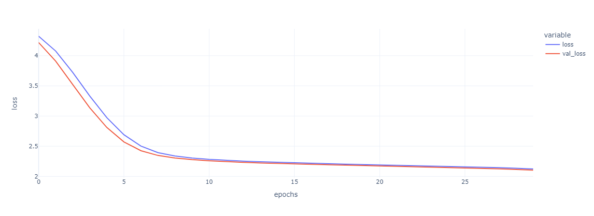

# Modélisation des mobilités quotidiennes des individus

Le but de ce notebook est d'explorer une méthodologie pour prédire les séquences de déplacements d'un individu à partir de ses caractéristiques socio-économiques.  
Ces premiers travaux ont pour objectifs de qualifier la pertinence de l'utilisation des algorithmes du traitement du langage naturel pour cette tâche.  

Définitions : 
- **Déplacement** : un déplacement est défini par un triplet (mode de déplacement, motif de déplacement, distance parcourue)
- **Séquence de déplacements** : c'est une suite ordonnée de déplacement effectué par un individu sur une journée.

Cette métohodologie se divise en 2 parties :
1. Apprentissage d'un modèle d'embedding pour effectuer un plongement sémentique des couples (mode, motif)
2. Apprentissage d'un RNN "vector to sequence" pour la prédiction d'une séquence de déplacement à partir d'un vecteur de caractéristiques socio-économiques

**Sommaire**    
- [Modélisation des mobilités quotidiennes des individus](#modélisation-des-mobilités-quotidiennes-des-individus)
  - [Récupération des données  ↑](#récupération-des-données--)
      - [Features ↑](#features-)
      - [Trajectoires ↑](#trajectoires-)
  - [Embedding des couples (mode, motif) ↑](#embedding-des-couples-mode-motif-)
    - [Description du modèle ↑](#description-du-modèle-)
    - [Entrainement du modèle ↑](#entrainement-du-modèle-)
    - [Visualisation ↑](#visualisation-)
  - [RNN vector to Sequence ↑](#rnn-vector-to-sequence-)
    - [Description du modèle ↑](#description-du-modèle--1)
    - [Entrainement du modèle ↑](#entrainement-du-modèle--1)
    - [Exemple de prédiction ↑](#exemple-de-prédiction-)

<!-- vscode-jupyter-toc-config
	numbering=false
	anchor=true
	flat=false
	minLevel=2
	maxLevel=6
	/vscode-jupyter-toc-config -->
<!-- THIS CELL WILL BE REPLACED ON TOC UPDATE. DO NOT WRITE YOUR TEXT IN THIS CELL -->

## Récupération des données  [&#8593;](#toc0_)

#### Features [&#8593;](#toc0_)
One-hot encoding des features CSP, type de commune et nombre de voitures.

<table border="1" class="dataframe">
  <thead>
    <tr style="text-align: right;">
      <th></th>
      <th>city_category_B</th>
      <th>city_category_C</th>
      <th>city_category_I</th>
      <th>city_category_R</th>
      <th>csp_1</th>
      <th>csp_2</th>
      <th>csp_3</th>
      <th>csp_4</th>
      <th>csp_5</th>
      <th>csp_6</th>
      <th>csp_7</th>
      <th>csp_8</th>
      <th>csp_no_csp</th>
      <th>n_cars_0</th>
      <th>n_cars_1</th>
      <th>n_cars_2+</th>
    </tr>
    <tr>
      <th>individual_id</th>
      <th></th>
      <th></th>
      <th></th>
      <th></th>
      <th></th>
      <th></th>
      <th></th>
      <th></th>
      <th></th>
      <th></th>
      <th></th>
      <th></th>
      <th></th>
      <th></th>
      <th></th>
      <th></th>
    </tr>
  </thead>
  <tbody>
    <tr>
      <th>110000011400001</th>
      <td>1</td>
      <td>0</td>
      <td>0</td>
      <td>0</td>
      <td>0</td>
      <td>0</td>
      <td>0</td>
      <td>0</td>
      <td>0</td>
      <td>0</td>
      <td>1</td>
      <td>0</td>
      <td>0</td>
      <td>0</td>
      <td>1</td>
      <td>0</td>
    </tr>
    <tr>
      <th>110000011500001</th>
      <td>1</td>
      <td>0</td>
      <td>0</td>
      <td>0</td>
      <td>0</td>
      <td>0</td>
      <td>0</td>
      <td>0</td>
      <td>0</td>
      <td>0</td>
      <td>0</td>
      <td>1</td>
      <td>0</td>
      <td>0</td>
      <td>0</td>
      <td>1</td>
    </tr>
    <tr>
      <th>110000011600002</th>
      <td>0</td>
      <td>0</td>
      <td>0</td>
      <td>1</td>
      <td>0</td>
      <td>0</td>
      <td>0</td>
      <td>0</td>
      <td>0</td>
      <td>0</td>
      <td>0</td>
      <td>1</td>
      <td>0</td>
      <td>0</td>
      <td>1</td>
      <td>0</td>
    </tr>
    <tr>
      <th>110000012500002</th>
      <td>1</td>
      <td>0</td>
      <td>0</td>
      <td>0</td>
      <td>0</td>
      <td>0</td>
      <td>0</td>
      <td>0</td>
      <td>0</td>
      <td>0</td>
      <td>1</td>
      <td>0</td>
      <td>0</td>
      <td>0</td>
      <td>0</td>
      <td>1</td>
    </tr>
    <tr>
      <th>110000013500002</th>
      <td>1</td>
      <td>0</td>
      <td>0</td>
      <td>0</td>
      <td>0</td>
      <td>0</td>
      <td>0</td>
      <td>0</td>
      <td>0</td>
      <td>1</td>
      <td>0</td>
      <td>0</td>
      <td>0</td>
      <td>0</td>
      <td>1</td>
      <td>0</td>
    </tr>
  </tbody>
</table>

#### Trajectoires [&#8593;](#toc0_)
Pour chaque individu nous récupérons une suite de déplacements définis par un triplet (mode, motif, distance)

    individual_id
    110000011400001    [[1, 3, 0.1], [3, 2, 2.2], [1, 1, 0.1], [3, 1,...
    110000011500001                         [[3, 1, 28.0], [3, 1, 28.0]]
    110000011600002           [[3, 3, 30.0], [3, 2, 18.0], [3, 1, 12.0]]
    110000012500002                         [[4, 3, 14.0], [4, 1, 14.0]]
    110000013500002         [[3, 9, 5.3214103219], [3, 1, 5.3214103219]]
    dtype: object

## Embedding des couples (mode, motif) [&#8593;](#toc0_)

L'objectif de ce modèle est d'apprendre un plongement sémentique de notre vocabulaire de déplacements.

Nous apprenons un modèle équivalent à word2vec : "un déplacement, définit par le couple (motif, mode), est à une trajectoire, ce qu'un mot est à une phrase"

### Description du modèle [&#8593;](#toc0_)

Exemple de notre modèle avec un embeddin en 2 dimensions : 

    Model: "sequential"
    _________________________________________________________________
     Layer (type)                Output Shape              Param #   
    =================================================================
     embedding (Embedding)       (None, 4, 2)              164       
                                                                     
     global_average_pooling1d (G  (None, 2)                0         
     lobalAveragePooling1D)                                          
                                                                     
     dense (Dense)               (None, 82)                246       
                                                                     
    =================================================================
    Total params: 410
    Trainable params: 410
    Non-trainable params: 0
    _________________________________________________________________
    

### Entrainement du modèle [&#8593;](#toc0_)

### Visualisation [&#8593;](#toc0_)

Visualisation des 2 premières dimensions de la couche d'embedding

## RNN vector to Sequence [&#8593;](#toc0_)

### Description du modèle [&#8593;](#toc0_)

Instanciation d'un RNN "vector to sequence".

- **Input** 
    - données socio-économiques d'un individu (*CSP, nombre de voitures, type de commune de résidence*) à l'instant `t = 0`, et `0` à l'instant `t > 0`
    - les features ont été "*one-hot encoded*"
    - l'input est de dimension `(n_individus, trajectory_len, n_features)`. 
- **Output** 
    - séquence de déplacements sur une journée. Un déplacement est défini par le triplet (*motif, mode, distance*)
    - l'output est de dimension : `(n_individus, trajectory_len, embedding_dim+1)`. 

Description du modèle :

    Model: "sequential_1"
    _________________________________________________________________
     Layer (type)                Output Shape              Param #   
    =================================================================
     lstm (LSTM)                 (None, 16, 10)            1080      
                                                                     
     dense_1 (Dense)             (None, 16, 3)             33        
                                                                     
    =================================================================
    Total params: 1,113
    Trainable params: 1,113
    Non-trainable params: 0
    _________________________________________________________________
    

### Entrainement du modèle [&#8593;](#toc0_)

### Exemple de prédiction [&#8593;](#toc0_)
Exemple de prédiction sur un individu du jeu test

    Vérité :
    [('3', '3', 12.0),
     ('3', '1', 12.0),
     ('<pad>', '<pad>', 0.0),
     ('<pad>', '<pad>', 0.0),
     ('<pad>', '<pad>', 0.0),
     ('<pad>', '<pad>', 0.0),
     ('<pad>', '<pad>', 0.0),
     ('<pad>', '<pad>', 0.0),
     ('<pad>', '<pad>', 0.0),
     ('<pad>', '<pad>', 0.0),
     ('<pad>', '<pad>', 0.0),
     ('<pad>', '<pad>', 0.0),
     ('<pad>', '<pad>', 0.0),
     ('<pad>', '<pad>', 0.0),
     ('<pad>', '<pad>', 0.0),
     ('<pad>', '<pad>', 0.0)]

    Prédiction :
    [('3', '3', 8.819596),
     ('3', '8', 6.8386908),
     ('<pad>', '<pad>', 4.405218),
     ('<pad>', '<pad>', 2.422762),
     ('<pad>', '<pad>', 1.0823743),
     ('<pad>', '<pad>', 0.28565556),
     ('<pad>', '<pad>', -0.12410135),
     ('<pad>', '<pad>', -0.28516874),
     ('<pad>', '<pad>', -0.3031626),
     ('<pad>', '<pad>', -0.25049067),
     ('<pad>', '<pad>', -0.17695284),
     ('<pad>', '<pad>', -0.11146371),
     ('<pad>', '<pad>', -0.06530311),
     ('<pad>', '<pad>', -0.038959734),
     ('<pad>', '<pad>', -0.027866863),
     ('<pad>', '<pad>', -0.026008332)]

